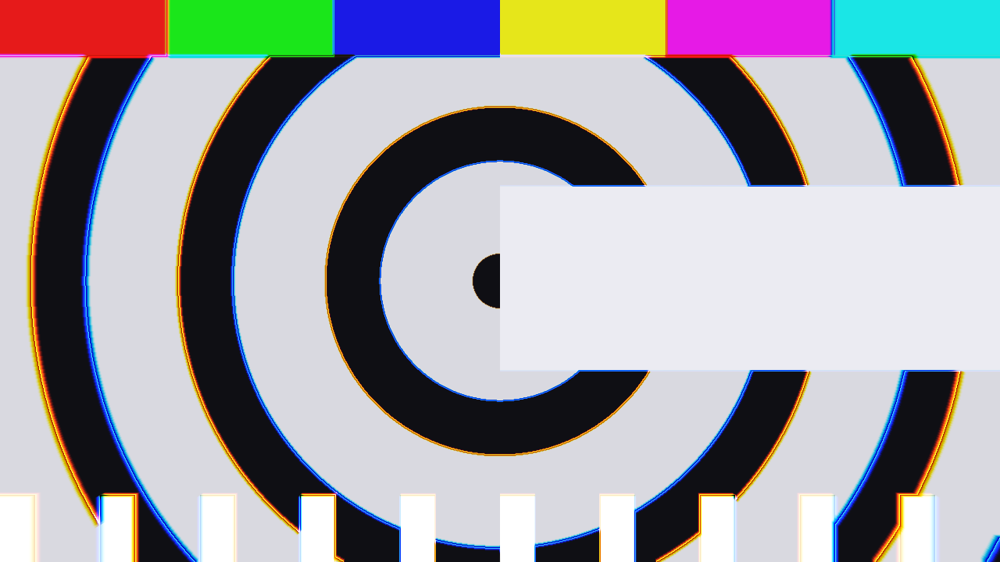
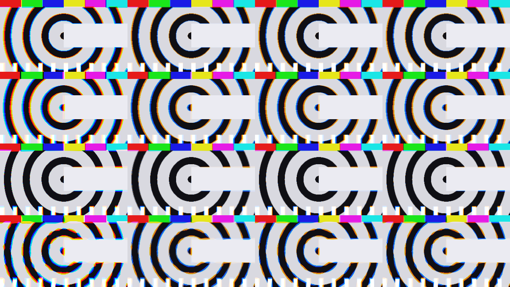

# Abomerration

> **AI-assisted project.** This codebase was created with [Claude](https://claude.com/claude-code)
> (Anthropic), directed and reviewed by a human author. The lens is verified
> numerically by an offline harness that drives the real plugin class in a
> headless GL context: it compares the dispersion field the GPU actually wrote
> against an independent C++ implementation across all four geometries (agreeing
> to 7e-07 of a frame width, with a control case that must disagree), measures
> the rendered channel offsets against the displacement the controls asked for to
> better than a pixel, and proves the same reaction arithmetic falls out of a
> milliseconds host and a seconds host alike (see [Status](#status)). It has since
> been **loaded into Resolume Arena and confirmed working**; the OpenFX build has
> still never been opened in Resolve, and the Windows build is compiled in CI and
> has never been run. Check it in your own rig before trusting it in a show.

Sound-reactive chromatic aberration for [Resolume](https://resolume.com) Arena
and Avenue, as an FFGL plugin — and the same lens again as an OpenFX plugin for
Resolve, Nuke, Natron and Vegas. Photographers spent a century getting rid of
chromatic aberration. This puts it back, wires it to the music, and keeps going
well past anything glass could do.



<sub>Radial geometry at Prism 32 with Edges up: warm fringes on the inner side of
each edge, cool on the outer, growing with distance from the optical centre — and
the flat areas untouched, because that is what a real lens does. Rendered by
`abomtest`, the offline harness.</sub>



<sub>Rows: Radial, Linear, Tangential, Turbulent. Columns: RGB Split, Prism 8,
Prism 16, Prism 32. The left column is the hard channel offset; the rest are the
same code integrating more of the spectrum.</sub>

**Try it in your browser, with your own footage:**
[abomerration-demo.stoatworks-labs.com](https://abomerration-demo.stoatworks-labs.com)
— the plugin's own shaders in WebGL2, with a kick-and-hats pattern synthesised on
the page to drive them, because a browser has no Resolume to route audio from.
Nothing is uploaded.

**Video:** [What it does, in 49 seconds](https://www.youtube.com/watch?v=l49OH5N5KUI)

<!-- downloads:start -->

## Download

**[v0.1.1](https://github.com/stoatworks-labs/abomerration/releases/tag/v0.1.1)** — prebuilt for macOS and Windows. Pick your platform:

<details>
<summary><b>macOS</b> — Universal (Apple Silicon + Intel)</summary>

| Build | Download | Size |
| --- | --- | --- |
| Universal (Apple Silicon + Intel) · .dmg disk image | [`abomerration-0.1.1-macos-universal.dmg`](https://github.com/stoatworks-labs/abomerration/releases/download/v0.1.1/abomerration-0.1.1-macos-universal.dmg) | 224 KB |
| Universal (Apple Silicon + Intel) · .zip archive | [`abomerration-macos-universal.zip`](https://github.com/stoatworks-labs/abomerration/releases/latest/download/abomerration-macos-universal.zip) | 178 KB |
| Universal (Apple Silicon + Intel) · .zip archive (OpenFX — Resolve, Vegas, Nuke) | [`abomerration-ofx-macos-universal.zip`](https://github.com/stoatworks-labs/abomerration/releases/latest/download/abomerration-ofx-macos-universal.zip) | 258 KB |

</details>

<details>
<summary><b>Windows</b> — x64</summary>

| Build | Download | Size |
| --- | --- | --- |
| x64 · .exe installer | [`abomerration-0.1.1-windows-x86_64-setup.exe`](https://github.com/stoatworks-labs/abomerration/releases/download/v0.1.1/abomerration-0.1.1-windows-x86_64-setup.exe) | 220 KB |
| x64 · .zip archive | [`abomerration-windows-x86_64.zip`](https://github.com/stoatworks-labs/abomerration/releases/latest/download/abomerration-windows-x86_64.zip) | 112 KB |
| x64 · .zip archive (OpenFX — Resolve, Vegas, Nuke) | [`abomerration-ofx-windows-x86_64.zip`](https://github.com/stoatworks-labs/abomerration/releases/latest/download/abomerration-ofx-windows-x86_64.zip) | 71 KB |

</details>

All builds, checksums and release notes: [github.com/stoatworks-labs/abomerration/releases](https://github.com/stoatworks-labs/abomerration/releases).

macOS builds are signed and notarised and open normally. The Windows builds are unsigned, so SmartScreen warns once.

<!-- downloads:end -->

## The one idea

**A lens does not split a picture into three channels.** It focuses every
wavelength at a slightly different magnification, and the coloured fringe you see
at the edge of a frame is the whole visible spectrum smeared along that path and
then integrated by the sensor.

So this plugin displaces the picture **once per wavelength sample** and adds the
results up through spectral weights. The familiar hard red/blue split is not a
separate mode or a different code path — it is what this becomes when you ask for
three samples, because the three-sample weight table is the identity. That is why
one control spans "cheap 1990s channel offset" and "real prismatic fringe" with
nothing else changing.

Two halves, and they never touch. **The field** says which way and how far, per
pixel. **The weight table** says what each sample counts as. Four geometries
times four spectrum settings is eight pieces of code rather than sixteen.

## What it does

**Four geometries.** *Radial* is what a real uncorrected lens does — zero on the
axis, worst in the corners. *Linear* is a prism in front of it, or a three-strip
camera out of registration, with no optical centre at all. *Tangential* rotates
each wavelength about the centre instead of pushing it outward, which no lens
does. *Turbulent* takes its direction from a drifting noise field, and is the
abomination the plugin is named for.

**Four ways for the music to drive it**, every one off by default — dropped on a
layer with nothing routed, this is an ordinary manual aberration lens and behaves
like one:

- a **beat pulse** locked to the host's transport, on any division from a quarter
  beat to two bars, with a decay from a linear ramp to a click;
- an **overall level** pump;
- a **band split**, where bass, mid and treble each push their own channel — so
  the picture comes apart along with the mix rather than merely pumping;
- **manual channel trims** on top of all of it.

Depth is *carved out of* the amount rather than added on top, so full depth means
silence renders a clean picture and the beat renders the whole effect.

**Edges** weights the dispersion by local contrast, because real lateral
aberration is invisible in a flat area — displacing a region of constant colour
returns the same region. At zero you get the misregistered-camera look instead.

**Show Field** paints the dispersion magnitude over a dim picture, with four
meters along the bottom for bass, mid, treble and beat. It exists because a flat
region with an enormous displacement looks exactly like one with none, and
because "is it hearing anything at all?" is otherwise unanswerable inside
Resolume.

## Install

Download from [Releases](https://github.com/stoatworks-labs/abomerration/releases).

- **Resolume (macOS):** put `Abomerration.bundle` in
  `~/Documents/Resolume Arena/Extra Effects`
- **Resolume (Windows):** put `Abomerration.dll` in
  `%USERPROFILE%\Documents\Resolume Arena\Extra Effects`
- **Resolve / Nuke / Natron / Vegas (macOS):** put `Abomerration.ofx.bundle` in
  `/Library/OFX/Plugins`

The OFX build is the manual lens only. OFX has no beat information and no audio
input — neither is in the API — so the reactive controls are not present there
rather than shown doing nothing.

## Build

```bash
git clone --recursive https://github.com/stoatworks-labs/abomerration.git
cd abomerration
cmake -B build -DCMAKE_BUILD_TYPE=Release
cmake --build build
cmake --install build     # straight into the Resolume folder, macOS
```

macOS builds universal by default. `-DBUILD_OFX=OFF` skips the OpenFX target.

## Status

`tools/verify.sh` runs 22 checks from a clean universal build, and all 22 pass.
What they establish, and what they do not:

| Checked | How |
| --- | --- |
| The GLSL field matches its C++ mirror | `--field`, all four geometries at a few thousand points, worst disagreement 7e-07 — **with a control case that must fail** |
| The picture really moves that far | `--offset` finds each channel's edge to better than a pixel and compares against arithmetic done outside the plugin |
| Spectrum is a quality control, not a tint | `--spectrum` renders a flat field at every setting and every amount and demands it come back flat |
| The quadrature leaves no visible footprint | `--quadrature` measures ripple at the sample spacing against a hard step edge: 4.8 / 2.0 / 1.2 of 255 |
| The reaction arithmetic | `--drive`, 14 assertions with no GL at all, including the bar recovery to 1.2e-07 |
| Milliseconds and seconds hosts agree | `--clock` — the trap that would otherwise make this a thousand times fast in the only host that matters |
| No dead controls | `tools/sweep.py`, all 24 |
| The bundle loads in a host | `ffgltest` instantiates it through `plugMain`, not just the class |
| It will survive codesign | the OFX plist is checked against the binary and a copy is ad-hoc signed |

**Loaded into Resolume Arena and confirmed working**, which is the one thing none
of the checks above could establish — every one of them drives the plugin class
directly or through `plugMain`, and none of them can say whether the twenty-four
controls present sensibly in a real inspector.

Still not done: the **OpenFX build has never been opened in Resolve**, Nuke,
Natron or Vegas — only smoke-tested through `ofxprobe`. The **Windows build is
compiled in CI and has never been run**. Nothing here has been through a show, and
no GPU other than an Apple M4 Max has rendered it.

**Known limit, measured:** at the cheapest Prism setting a hard black-to-white
edge leaves about 5 of 255 of ripple in the fringe. Each wavelength sample reads
from a mip level covering twice the gap to its neighbour, which is the correct
anti-aliasing width, and more samples buy a sharper picture at the same
smoothness rather than less ripple. See `source/shaders/Copy.cpp` for the
numbers, including what it looked like before that prefilter existed.

Render cost, measured by `--bench` on an M4 Max: 0.42–0.52 ms/frame at 1080p,
0.89–1.34 ms at 4K.

## Licence

MIT — see [LICENCE](LICENSE). Built on the
[Resolume FFGL SDK](https://github.com/resolume/ffgl) (BSD-3) and the
[OpenFX](https://github.com/AcademySoftwareFoundation/openfx) support library
(BSD-3); see [ATTRIBUTIONS.md](ATTRIBUTIONS.md).
